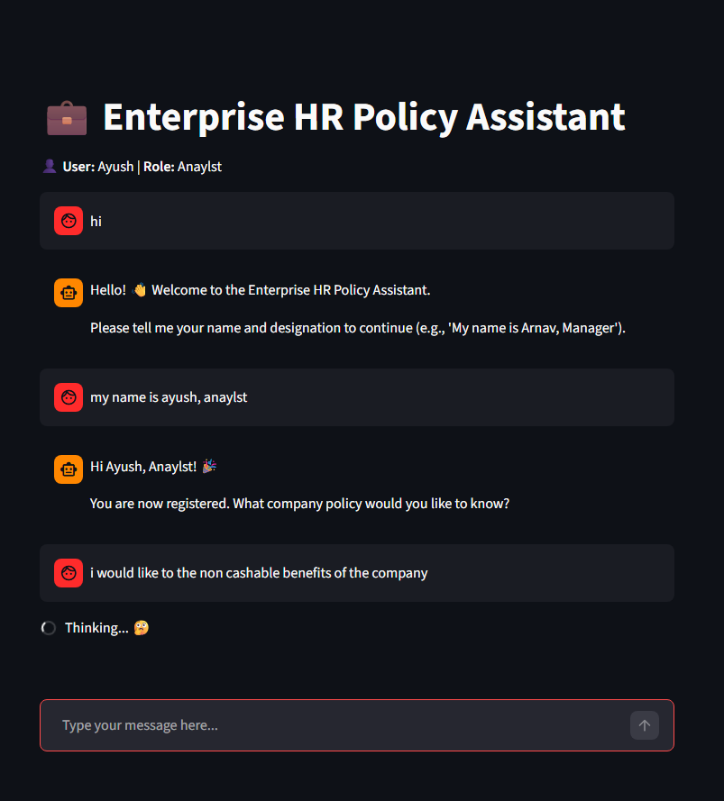
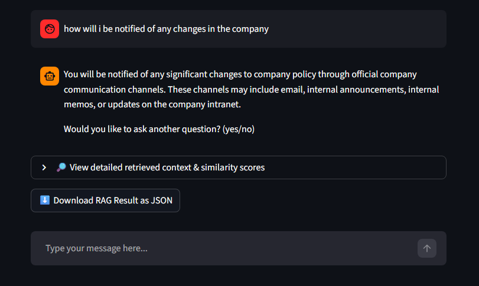
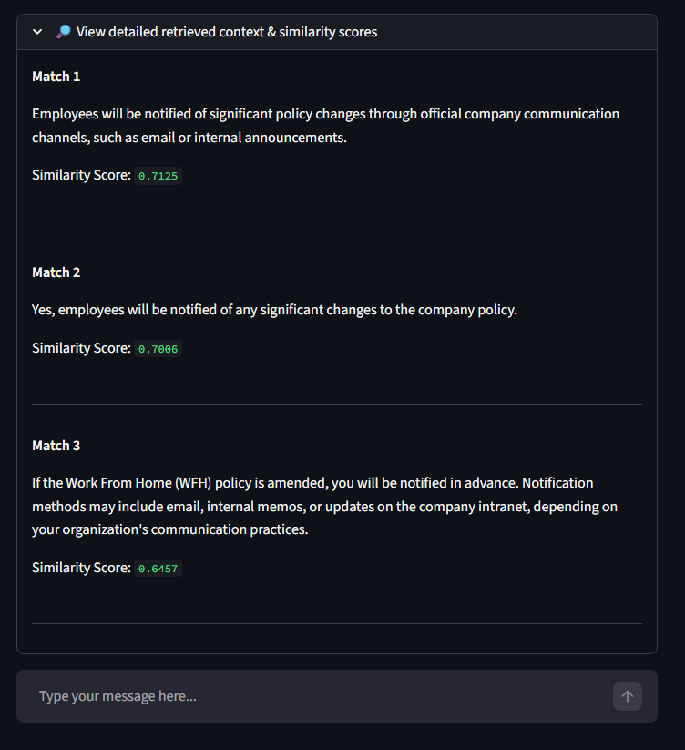

<div align="center">
   
# 💼 Enterprise HR Policy Assistant

</div>

<div align="center">
   
An AI-powered **Enterprise HR Policy Assistant** built with Python, langchain and langraph workdlows , with Endee vector database using strova-ai/hr-policies-qa-dataset.
</div>

---

It allows employees to query company policies, while HR/admin/CEO users can add or edit policies (in work). The assistant leverages **RAG (Retrieval-Augmented Generation)** for accurate, context-aware answers.

---

## 🚀 Table of Contents

1. [Project Overview & Problem Statement](#project-overview--problem-statement)  
2. [System Design & Technical Approach](#system-design--technical-approach)
3. [System Visualisations](#system-visualisation)
4. [Requirements](#requirements)  
5. [Setup Instructions](#setup-instructions)  
   - [Clone & Setup Environment](#clone--setup-environment)  
   - [Docker & Endee Setup](#docker--endee-setup)  
   - [Running the App](#running-the-app)  
6. [How Endee is Used](#how-endee-is-used)  
7. [Usage](#usage)  
8. [Project Structure](#project-structure)  

---

## 📌 Project Overview & Problem Statement

**Problem:** Employees often struggle to access or interpret company HR policies. HR teams need a tool to quickly respond to policy queries and maintain up-to-date documentation.

**Solution:** A conversational AI assistant that:  

- Captures employee name and designation.  
- Provides accurate answers about company HR policies using a RAG pipeline.
- Supports continued interaction with yes/no prompts and optional detailed RAG output with downloadable data.
- Allows HR/admin/CEO users to add or edit policies in a secure, password-protected manner.

---

## 💻 System Design & Technical Approach

**Architecture Highlights:**

1. **Chat Interface**: Built with **Streamlit**, mimicking a mobile chat UI 
2. **Intent Detection**: Uses **Google Gemini LLM** to classify inputs as `lead_capture` or `policy_query`.  
3. **RAG (Retrieval-Augmented Generation)**:  
   - Employee queries are embedded via `SentenceTransformers`.  
   - Top-k matching policy entries are retrieved from **Endee vector DB**.  
   - Gemini LLM generates human-readable answers using context.  
4. **Role-Based Access**: (in-work) 
   - Normal employees can query policies.  
   - HR/Admin/CEO users must enter a password to add/edit policies.  
5. **Session State**: Tracks captured names, designations, chat history, and RAG results for seamless multi-turn conversations.  
6. **Export Options**: Users can download RAG results in JSON format.  

**Flow:**  

```text
User input -> Intent Detection -> Lead Capture / Policy Node ->
[If Policy Node] -> Embed query -> Search Endee -> Generate Answer -> Display
```

## System Visualisations

<div align="center">
   
### Coversation Start



### RAG retrieval message



### Structured JSON Output+ download 



</div>

## 📝 Requirements

- Python 3.12+
- Streamlit
- langchain_google_genai
- sentence-transformers
- Endee vector database
- Docker (optional for local Endee deployment)
- Other Python packages: `tqdm`, `numpy`, `pandas` (as per requirements.txt)

---

## ⚙️ Setup Instructions

### 1️⃣ Clone & Setup Environment

```bash
# Clone your forked repo
git clone https://github.com/<your-username>/endee-forked.git

# Navigate into project folder
cd endee-forked/Project_agent_app

# Create virtual environment
python -m venv venv

# Activate virtual environment

# Windows
venv\Scripts\activate

# Linux /Mac
source venv/bin/activate

# Install dependencies
pip install -r requirements.txt
```

---

### 2️⃣ Docker & Endee Setup

#### Option A: Use Docker for Endee server

1. Make sure Docker Desktop is running.

2. Use the included docker-compose.yml to start Endee:

```bash
docker-compose up -d
```

#### Services in docker-compose.yml

- `endee` → Pulls official Endee image and exposes port `8080`
- `endee-oss` → Optionally builds local Endee for OSS development

#### Verify Endee is running

```bash
curl http://localhost:8080/health
```

If running correctly, it will return a health status response.

---

### 3️⃣ Configure Environment

Update `config.py` with your Endee instance details:

```python
ENDEE_URL = "http://localhost:8080"
INDEX_NAME = "hr_policies"
```

---

### 4️⃣ Running the App

#### Run Streamlit frontend

```bash
streamlit run streamlit_app.py
```

Open in browser:

```
http://localhost:8501
```

Features:

- Chat interface
- View similarity scores and retrieved context
- Download results as JSON

---

#### Run Terminal Agent (Testing)

```bash
python run_agent.py
```

---

## 🧠 How Endee is Used

### Vector Insertion

Process:

1. Policy text is converted into embeddings using SentenceTransformer  
2. Embeddings stored inside Endee vector database  
3. Metadata includes:

```json
{
  "id": "unique_id",
  "meta": {
    "text": "policy content"
  }
}
```

---

### RAG Search Process

When user asks a question:

1. Query converted to embedding
2. Endee retrieves Top-K similar vectors
3. Gemini LLM generates final answer using retrieved context

---

### Metadata Storage

Each vector stores:

- Text content
- Unique ID
- Similarity score (during search)

---

## Usage

1. Start chat
2. Enter name and designation

Example:

```
My name is Arnav, Manager
```

3. Ask policy question:

```
How many leaves do we get?
```

4. Assistant retrieves answer using Endee

5. Continue conversation:

```
yes → ask another question
no / exit → end conversation
```

6. Optional features:

- View detailed retrieved context
- View similarity scores
- Download JSON results

7. HR/Admin users can: (in-progress)

- Add policies 
- Remove policies
- Insert vectors into Endee database 

---

## 📁 Project Structure

```
Project_agent_app/
│
├── agent/
│   ├── graph.py              # Router and state management
│   ├── intent_chain.py      # Intent detection using Gemini
│   ├── lead_capture_node.py # Captures name and designation
│   ├── policy_node.py        # Handles policy queries
|   ├── state.py             # Handles state execution
│   └── rag_tool.py          # RAG pipeline implementation
│
├── vectorstore/
│   └── endee_client.py      # Endee vector insert and search
│
├── streamlit_app.py         # Streamlit chat frontend
├── run_agent.py             # CLI testing interface
├── config.py                # API keys and Endee config
├── requirements.txt
├── docker-compose.yml      # Endee server setup
└── README.md
```

---

## ⚡ Key Features

- Multi-turn conversational AI
- HR policy question answering
- RAG-based accurate responses
- Endee vector database integration
- Similarity score visualization
- JSON export of results
- Docker support
- Streamlit chat UI
- Role-based access control
- CLI and Web interfaces

---

## ✅ Summary

This project provides a complete Enterprise HR Assistant using:

- Streamlit frontend  
- Gemini LLM  
- Endee vector database  
- SentenceTransformers embeddings  
- Docker deployment  

It enables accurate, scalable, and intelligent HR policy retrieval.

---
